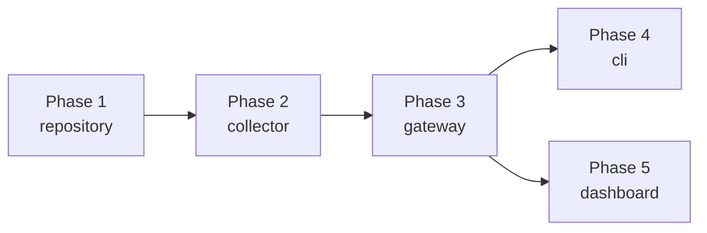

# ADR: デプロイ戦略と実装フェーズ

## Status

Accepted (2026-04-09)

## Context

5つのコンポーネント (repository, collector, gateway, dashboard, cli) を
GitHub Actions 経由で Cloudflare Workers にデプロイする。
バックエンド（後続依存が多い）から順にデプロイする。

## Decision

### 実装・デプロイ順序



### Phase 1: repository

**依存:** なし（他の全コンポーネントが依存）

- R2 バケット作成
- NDJSON 書き込み・読み取り API
- DuckDB-WASM による集計クエリ
- Service Binding 用インターフェース定義
- GitHub Actions: `wrangler deploy`

**完了条件:** Service Binding 経由で write/query が動作

### Phase 2: collector

**依存:** repository (Service Binding)

- Cron Trigger 設定（日次）
- Marketplace API クライアント（flags=950, Exponential Backoff）
- Queue によるページング制御
- repository への書き込み委譲
- GitHub Actions: `wrangler deploy`

**完了条件:** 日次で全 ~118k 件を R2 に書き込み

### Phase 3: gateway

**依存:** repository (Service Binding)

- Hono RPC エンドポイント定義
- repository の集計結果を JSON で提供
- GitHub Actions: `wrangler deploy`

**完了条件:** trending / growth / search API が動作

### Phase 4: cli

**依存:** gateway (HTTP)

- Hono RPC client で型安全な API 呼び出し
- JSON / table / text 出力
- npm / bun でインストール可能

**完了条件:** `meguru trending` が動作

### Phase 5: dashboard

**依存:** repository (Service Binding)

- Hono JSX (SSR)
- トレンド一覧、カテゴリ別推移、成長率ランキング
- GitHub Actions: `wrangler deploy`

**完了条件:** ブラウザでダッシュボード表示

### GitHub Actions デプロイ

```yaml
# 各コンポーネント共通パターン
on:
  push:
    branches: [main]
    paths:
      - "apps/meguru/<component>/**"

jobs:
  deploy:
    runs-on: ubuntu-latest
    steps:
      - uses: actions/checkout@v4
      - uses: oven-sh/setup-bun@v2
      - run: bun install
      - run: bun run --filter @meguru/<component> build
      - uses: cloudflare/wrangler-action@v3
        with:
          workingDirectory: apps/meguru/<component>
          apiToken: ${{ secrets.CLOUDFLARE_API_TOKEN }}
```

- main ブランチへのマージで自動デプロイ
- paths フィルタでコンポーネント単位の差分デプロイ
- Cloudflare API Token は GitHub Secrets に格納

## Consequences

### Positive

- バックエンドから順にデプロイするため、各 Phase で動作確認が可能
- Phase 2 完了時点でデータ収集が開始され、早期に価値が出る
- paths フィルタにより無関係な変更でデプロイが走らない

### Negative

- Phase 1〜2 はローカルでの Service Binding テストが必要（wrangler dev）
- Cloudflare API Token の管理が必要
